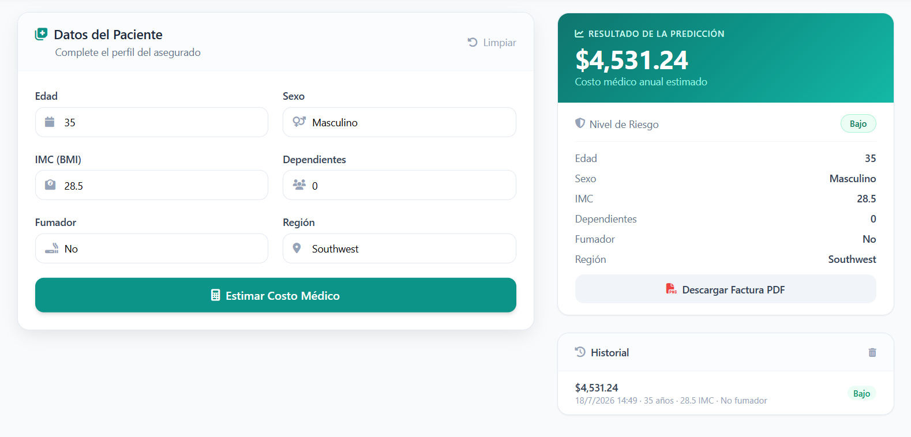
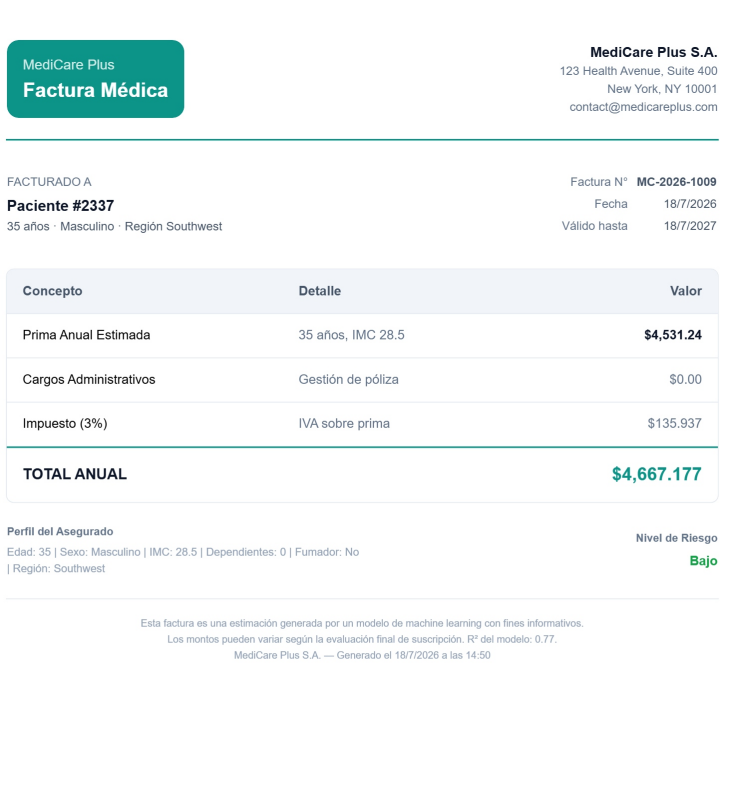

 

 

# MediCare Plus
### *Predicción Inteligente de Costos Médicos*

 

     

 

[📖 USAGE](./USAGE.md) · [🎥 Demo](https://www.youtube.com/watch?v=G8jQYgYtXZ4) · [📊 Dataset](https://www.kaggle.com/mirichoi0218/insurance) · [🐙 GitHub](https://github.com/MHAlberto/MedicalCostPrediction)

---

## La Historia

**MediCare Plus** es una aseguradora de salud que enfrenta un dilema: *¿cómo calcular primas justas cuando cada cliente es único?*

Con miles de asegurados históricos, la empresa quiere dejar atrás los criterios genéricos y usar **datos reales** para predecir el costo médico anual de cada cliente potencial.

> *"Conociendo la edad, el IMC, los hábitos y la región de nuestros asegurados, ¿podemos predecir su costo médico anual para ofrecerles una prima justa?"*

La respuesta: un modelo de **Regresión Lineal Múltiple** (R² = **0.77**) que transforma datos históricos en predicciones accionables.

---

## Capturas de Pantalla

  

---

## Video Demo

**Mario H. Alberto** — *Data Scientist & ML Engineer*

 · 

 
Hecho con ❤️ y Python

